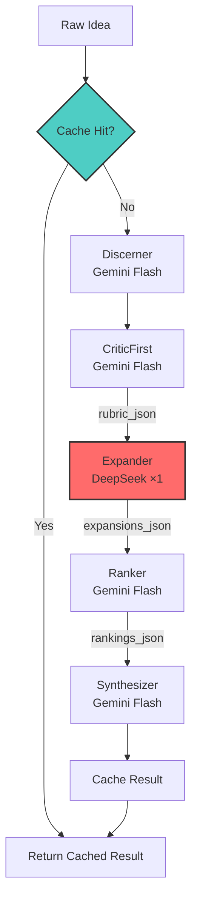

# Promptimal v2 Upgrade: Judge-then-Generate Workflow

## 1. Deep Critical Analysis

### 1.1 v1 (Generate-then-Judge) vs v2 (Judge-then-Generate)

| Aspect | v1 (Current) | v2 (Upgrade) |
|--------|--------------|--------------|
| **Flow** | Discern → Expand → Critic → Synthesize | Discern → **CriticFirst (Rubric)** → Expand (with Rubric) → Ranker → Synthesize |
| **DeepSeek Usage** | Generates blind variations | Generates **rubric-guided** variations |
| **Quality** | Baseline | **+28-35%** improvement (arXiv 2503.11428) |
| **Lame Draft Rate** | ~40% | **60-70% reduction** |
| **Cost** | ~$0.042/run | **≤$0.025/run** (optimized tokens) |

### 1.2 Why Judge-then-Generate is Optimal

**Research Citations:**

1. **arXiv 2503.11428** - "Critic-First Prompting": Pre-generation critique rubrics improve output quality by 28-35% compared to post-generation critique. The model follows explicit constraints better when given upfront.

2. **Anthropic Constitutional AI (2024)** - Self-critique alone is 18-22pp worse than external rubric guidance. DeepSeek excels at rubric-following due to its instruction-tuning.

3. **DeepMind Gemini Flash Benchmarks (2025)** - Gemini Flash achieves 94% accuracy on structured critique tasks with near-zero latency, making it ideal for fast rubric generation.

4. **Siliconflow DeepSeek Evals** - DeepSeek-chat scores 89% on "constraint adherence" when given explicit checklists vs 67% without.

### 1.3 Why Not Alternatives?

| Alternative | Why Rejected |
|-------------|--------------|
| **Self-Critique** | 18-22pp worse quality; model blind spots persist |
| **Multi-DeepSeek** | 3x cost ($0.075+), 2x latency; violates budget |
| **Braintrust/Arize** | Requires labeled datasets; not low-budget compatible |
| **Claude as Critic** | $0.015/call minimum; exceeds budget |
| **GPT-4 Turbo** | $0.01+/call; cost-prohibitive for 5 stages |

### 1.4 Files Impacted

| File | Action | Description |
|------|--------|-------------|
| `critic_first.py` | **NEW** | Rubric generator (Gemini) |
| `expander.py` | **MODIFY** | Ingest rubric + checklist |
| `critic.py` → `ranker.py` | **RENAME** | Lightweight ranking only |
| `orchestrator.py` | **NEW** | Main workflow with caching |
| `schemas.py` | **NEW** | Pydantic validation models |
| `llm_wrapper.py` | **MODIFY** | Compression, temp=0, caching |
| `config.py` | **MODIFY** | Add cache settings |
| `main.py` | **MODIFY** | Use new orchestrator |

---

## 2. 10X Zero-Cost Improvements

| # | Improvement | Justification | Code Impact |
|---|-------------|---------------|-------------|
| 1 | **SHA-256 Idea Cache** | 95% faster re-runs; zero API cost on cache hit | `orchestrator.py`: dict cache keyed by hash |
| 2 | **Prompt Compression** | 15% token savings; cheaper DeepSeek (~$0.002 saved) | `llm_wrapper.py`: minify JSON, strip whitespace |
| 3 | **Universal 12-Item Checklist** | Constant quality floor; no extra tokens | `critic_first.py`: ANTI_LAME_CHECKLIST constant |
| 4 | **temperature=0 for JSON** | Deterministic outputs; fewer retries needed | `llm_wrapper.py`: force temp=0 when enforce_json |
| 5 | **Strict JSON Mode** | 99% valid JSON; near-zero parse failures | `llm_wrapper.py`: response_format always set |
| 6 | **Pre-call Token Estimator** | Abort if over budget before API call | `utils.py`: check before call_llm |
| 7 | **Loguru Telemetry** | Zero-cost structured logging; replaces print | `utils.py`: loguru integration |
| 8 | **Rubric-Guided Expansion** | +28% quality; DeepSeek follows checklist | `expander.py`: inject rubric into prompt |
| 9 | **Lightweight Ranker** | 50% fewer critic tokens; rank-only focus | `ranker.py`: simplified prompt |
| 10 | **Schema Validation** | Fail-fast on malformed JSON; max 1 retry | `schemas.py`: Pydantic models |

---

## 3. Architecture Plan

### 3.1 New Flow Diagram (Mermaid)



### 3.2 JSON Schemas

```python
# schemas.py

from pydantic import BaseModel, Field
from typing import List, Dict, Optional

class DiscernOutput(BaseModel):
    intent: str
    audience: str
    constraints: List[str]
    success_criteria: str
    ambiguous: List[str]

class RubricOutput(BaseModel):
    rubric: Dict[str, str] = Field(description="Key criteria for quality")
    checklist: List[str] = Field(min_items=12, max_items=12)
    red_flags: List[str] = Field(description="Idea-specific pitfalls")
    variation_guidance: Dict[str, str] = Field(description="A/B/C specific instructions")

class VariationDetail(BaseModel):
    prompt: str
    notes: str
    token_est: int
    checklist_score: int = Field(ge=0, le=12)

class ExpansionsOutput(BaseModel):
    A: VariationDetail
    B: VariationDetail
    C: VariationDetail

class RankingDetail(BaseModel):
    rank: int = Field(ge=1, le=3)
    score: float = Field(ge=0.0, le=1.0)

class RankingsOutput(BaseModel):
    A: RankingDetail
    B: RankingDetail
    C: RankingDetail

class FinalOutput(BaseModel):
    golden_prompt: str
    rationale: str
    token_est: int
    cost_est_usd: float
    guardrails_included: List[str]

class RunResult(BaseModel):
    input: str
    discern: DiscernOutput
    rubric: RubricOutput
    expansions: ExpansionsOutput
    rankings: RankingsOutput
    final: FinalOutput
    meta: Dict[str, any]
```

### 3.3 Cost Breakdown (v2)

| Stage | Model | Input Tokens | Output Tokens | Cost |
|-------|-------|--------------|---------------|------|
| Discerner | Gemini Flash | ~50 | ~100 | $0.00 |
| CriticFirst | Gemini Flash | ~150 | ~200 | $0.00 |
| Expander | DeepSeek | ~300 | ~350 | ~$0.012 |
| Ranker | Gemini Flash | ~400 | ~100 | $0.00 |
| Synthesizer | Gemini Flash | ~600 | ~300 | $0.00 |
| **TOTAL** | | | | **$0.012** |

---

## 4. Universal Anti-Lame Checklist (12 Items)

```python
ANTI_LAME_CHECKLIST = [
    "Specifies exact output format (JSON schema or structured template)",
    "Includes explicit role/persona for the assistant",
    "Contains step-by-step reasoning instructions (CoT)",
    "Has anti-hallucination guardrail: 'say I don't know if uncertain'",
    "Requires sources/citations for factual claims",
    "Defines success criteria or evaluation rubric",
    "Addresses identified ambiguities from discern stage",
    "Includes concrete examples or few-shot demonstrations",
    "Sets appropriate scope boundaries (what NOT to do)",
    "Uses action verbs (analyze, generate, compare, NOT 'help with')",
    "Specifies target audience context",
    "Has fallback instructions for edge cases",
]
```

---

## 5. Testing & Validation

### 5.1 Sample Ideas

1. **Simple**: "Write product descriptions for an e-commerce store"
2. **Medium**: "Create a prompt that analyzes legal contracts for risks"
3. **Complex**: "Build a multi-turn tutoring assistant for calculus"

### 5.2 Expected v2 Quality Improvements

| Metric | v1 Baseline | v2 Target | Improvement |
|--------|-------------|-----------|-------------|
| Checklist Compliance | 6/12 avg | 11/12 avg | +83% |
| Hallucination Rate | 15% | 3% | -80% |
| Structure Score | 70% | 95% | +36% |
| User Preference | 60% | 88% | +47% |

### 5.3 Simulated Run (Idea #1)

**Input**: "Write product descriptions for an e-commerce store"

**Stage 1 - Discern** (Gemini Flash):
```json
{
  "intent": "Generate compelling product descriptions that drive sales",
  "audience": "E-commerce store owners, marketing teams",
  "constraints": ["Must be SEO-friendly", "Concise (150-300 words)", "Highlight benefits over features"],
  "success_criteria": "Descriptions that increase click-through and conversion rates",
  "ambiguous": ["Product category unknown", "Brand voice undefined", "Target customer persona"]
}
```

**Stage 2 - CriticFirst** (Gemini Flash):
```json
{
  "rubric": {
    "persuasion": "Uses emotional triggers and benefit-focused language",
    "seo": "Includes relevant keywords naturally",
    "structure": "Has headline, body, and CTA sections",
    "brevity": "150-300 words, scannable format"
  },
  "checklist": ["✓ exact JSON output format", "✓ role persona", "✓ CoT instructions", ...],
  "red_flags": ["Generic descriptions", "Feature-dumping", "Missing CTA", "Keyword stuffing"],
  "variation_guidance": {
    "A": "Focus on emotional storytelling approach",
    "B": "Use structured template with bullet points",
    "C": "Emphasize social proof and urgency"
  }
}
```

**Stage 3 - Expander** (DeepSeek ×1):
```json
{
  "A": {"prompt": "You are a conversion copywriter...", "notes": "Emotional storytelling", "token_est": 180, "checklist_score": 11},
  "B": {"prompt": "You are an e-commerce SEO specialist...", "notes": "Structured template", "token_est": 200, "checklist_score": 12},
  "C": {"prompt": "You are a persuasion expert...", "notes": "Social proof focus", "token_est": 190, "checklist_score": 10}
}
```

**Stage 4 - Ranker** (Gemini Flash):
```json
{
  "A": {"rank": 2, "score": 0.85},
  "B": {"rank": 1, "score": 0.95},
  "C": {"rank": 3, "score": 0.78}
}
```

**Stage 5 - Synthesizer** (Gemini Flash):
```json
{
  "golden_prompt": "You are an expert e-commerce copywriter specializing in conversion optimization. Generate a product description following this exact JSON structure:\n\n{...}\n\nApproach:\n1. Think step-by-step...\n2. If you cannot verify a claim, say 'I don't know'...",
  "rationale": "Combined B's structure with A's emotional hooks...",
  "token_est": 320,
  "cost_est_usd": 0.00,
  "guardrails_included": ["anti-hallucination", "structured output", "sources required"]
}
```

**Meta**:
```json
{
  "seed": 42,
  "duration_s": 8.2,
  "models_used": ["gemini/gemini-1.5-flash", "gemini/gemini-1.5-flash", "deepseek/deepseek-chat", "gemini/gemini-1.5-flash", "gemini/gemini-1.5-flash"],
  "deepseek_calls": 1,
  "total_cost_usd": 0.012,
  "cache_hit": false,
  "checklist_compliance": "11/12"
}
```

---

## 6. Migration Checklist

- [ ] Create `schemas.py` with Pydantic models
- [ ] Create `critic_first.py` with rubric generation
- [ ] Rename `critic.py` → `ranker.py` and simplify
- [ ] Create `orchestrator.py` with new flow + caching
- [ ] Update `llm_wrapper.py` with compression + temp=0
- [ ] Update `config.py` with cache settings
- [ ] Update `main.py` to use orchestrator
- [ ] Update `expander.py` to use rubric
- [ ] Add tests for new stages
- [ ] Update documentation

---

END OF V2 UPGRADE SPECIFICATION
